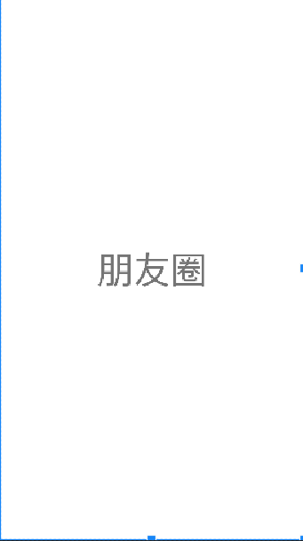

# 一、项目总体介绍

**总体内容**：此项目是安卓APP的门户界面框架设计，包含了4个table页面，能简单实现table页面之间的点击切换功能。

**使用到的技术**：使用布局（layout）和分段（fragment），对控件进行点击监听。

**页面总体效果**：


**代码目录结构**：


# 二、各页面(layout)设计展示

### 1、顶部页界面：top.xml页面的设计

（1）在layout里新建一个名为top.xml的文件，在布局小组件俩面拖一个LinearLayout，然后在LinearLayout之下拖一个textView进来


（2）然后再稍微设计一下字体和背景颜色，代码如下：

```xml
<?xml version="1.0" encoding="utf-8"?>
<LinearLayout xmlns:android="http://schemas.android.com/apk/res/android"
    android:layout_width="match_parent"
    android:layout_height="wrap_content">

    <TextView
        android:id="@+id/textView"
        android:layout_width="0dp"
        android:layout_height="60dp"
        android:layout_weight="1"
        android:background="@color/teal_200"
        android:gravity="center"
        android:text="@string/textView"
        android:textAlignment="center"
        android:textColor="@color/white"
        android:textSize="30sp" />
</LinearLayout>
```

（3）效果图如下：


### 2、底部页界面：bottom.xml页面的设计

（1）将需要用到的四个小图标准备好拖入mipmap中：


（2）在layout里新建一个名为tbottom.xml的文件，在布局小组件俩面拖一个横向排列的LinearLayout，然后在LinearLayout之下拖四个纵向排列的LinearLayout进来，在每个LinearLayout中加入ImageView图片分别选择好：


（3）然后再稍微设计一下字体和相对布局位置，代码如下：

```xml
<?xml version="1.0" encoding="utf-8"?>
<LinearLayout xmlns:android="http://schemas.android.com/apk/res/android"
    xmlns:app="http://schemas.android.com/apk/res-auto"
    android:layout_width="match_parent"
    android:layout_height="wrap_content"
    android:backgroundTint="@android:color/darker_gray">

    <LinearLayout
        android:id="@+id/first"
        android:layout_width="wrap_content"
        android:layout_height="wrap_content"
        android:layout_weight="1"
        android:orientation="vertical">

        <ImageView
            android:id="@+id/imageView"
            android:layout_width="match_parent"
            android:layout_height="wrap_content"
            app:srcCompat="@mipmap/messige" />

        <TextView
            android:id="@+id/textView3"
            android:layout_width="match_parent"
            android:layout_height="wrap_content"
            android:gravity="center"
            android:text="@string/textView3"
            android:textSize="18sp" />

    </LinearLayout>

    <LinearLayout
        android:id="@+id/second"
        android:layout_width="wrap_content"
        android:layout_height="wrap_content"
        android:layout_weight="1"
        android:orientation="vertical">

        <ImageView
            android:id="@+id/imageView2"
            android:layout_width="match_parent"
            android:layout_height="wrap_content"
            app:srcCompat="@mipmap/friend" />

        <TextView
            android:id="@+id/textView4"
            android:layout_width="match_parent"
            android:layout_height="wrap_content"
            android:gravity="center"
            android:text="@string/textView4"
            android:textSize="18sp" />
    </LinearLayout>

    <LinearLayout
        android:id="@+id/third"
        android:layout_width="wrap_content"
        android:layout_height="wrap_content"
        android:layout_weight="1"
        android:orientation="vertical">

        <ImageView
            android:id="@+id/imageView3"
            android:layout_width="match_parent"
            android:layout_height="wrap_content"
            app:srcCompat="@mipmap/finding" />

        <TextView
            android:id="@+id/textView5"
            android:layout_width="match_parent"
            android:layout_height="wrap_content"
            android:gravity="center"
            android:text="@string/textView5"
            android:textSize="18sp" />
    </LinearLayout>

    <LinearLayout
        android:id="@+id/fourth"
        android:layout_width="wrap_content"
        android:layout_height="wrap_content"
        android:layout_weight="1"
        android:orientation="vertical">

        <ImageView
            android:id="@+id/imageView4"
            android:layout_width="match_parent"
            android:layout_height="wrap_content"
            app:srcCompat="@mipmap/my" />

        <TextView
            android:id="@+id/textView6"
            android:layout_width="match_parent"
            android:layout_height="wrap_content"
            android:gravity="center"
            android:text="@string/textView6"
            android:textSize="18sp" />

    </LinearLayout>
</LinearLayout>
```

（4）效果图如下：


### 3、主题界面：activity_main.xml页面设计

（1）在布局小组件里面想拖一个LinearLayout，在此布局之下拖一个FragmentLayout并将其id改为content，在code中用include引入之前的顶部界面top.xml以及底部界面bottom.xml


（2）代码如下：

```xml
<?xml version="1.0" encoding="utf-8"?>
<LinearLayout xmlns:android="http://schemas.android.com/apk/res/android"
    xmlns:app="http://schemas.android.com/apk/res-auto"
    xmlns:tools="http://schemas.android.com/tools"
    android:layout_width="match_parent"
    android:layout_height="match_parent"
    android:orientation="vertical"
    tools:context=".MainActivity">

    <include layout="@layout/top"></include>

    <FrameLayout
        android:id="@+id/content"
        android:layout_width="match_parent"
        android:layout_height="0dp"
        android:layout_weight="1"/>

    <include layout="@layout/bottom"></include>

</LinearLayout>
```

（3）效果图如下：


### 4、四个fragment页面设计

我们之前在bottom里面放了四个按钮，当每一个按钮点击事件触发之后要跳转到相应的页面（fragment）中去，所以要给四个分别设计单独页面

（1）聊天页面设计fragment_first.xml，组件的布局如下：


代码如下：

```xml
<?xml version="1.0" encoding="utf-8"?>
<LinearLayout xmlns:android="http://schemas.android.com/apk/res/android"
    xmlns:tools="http://schemas.android.com/tools"
    android:layout_width="match_parent"
    android:layout_height="match_parent"
    tools:context=".first">

    <!-- TODO: Update blank fragment layout -->
    <TextView
        android:layout_width="match_parent"
        android:layout_height="match_parent"
        android:gravity="center"
        android:text="这是微信聊天页面"
        android:textSize="50sp" />

</LinearLayout>
```

效果图如下：


（2）通讯录页面设计fragment_second.xml，组件的布局如下：


代码如下：

```xml
<?xml version="1.0" encoding="utf-8"?>
<LinearLayout xmlns:android="http://schemas.android.com/apk/res/android"
    xmlns:tools="http://schemas.android.com/tools"
    android:layout_width="match_parent"
    android:layout_height="match_parent"
    tools:context=".first">

    <!-- TODO: Update blank fragment layout -->
    <TextView
        android:layout_width="match_parent"
        android:layout_height="match_parent"
        android:gravity="center"
        android:text="通讯录"
        android:textSize="50sp" />

</LinearLayout>
```

效果图如下：


（3）朋友圈页面设计fragment_third.xml，组件的布局如下：


代码如下：

```xml
<?xml version="1.0" encoding="utf-8"?>
<LinearLayout xmlns:android="http://schemas.android.com/apk/res/android"
    xmlns:tools="http://schemas.android.com/tools"
    android:layout_width="match_parent"
    android:layout_height="match_parent"
    tools:context=".first">

    <!-- TODO: Update blank fragment layout -->
    <TextView
        android:layout_width="match_parent"
        android:layout_height="match_parent"
        android:gravity="center"
        android:text="朋友圈"
        android:textSize="50sp" />

</LinearLayout>
```

效果图如下：




（4）我的页面设计fragment_first.xml，组件的布局如下：


代码如下：

```xml
<?xml version="1.0" encoding="utf-8"?>
<LinearLayout xmlns:android="http://schemas.android.com/apk/res/android"
    xmlns:tools="http://schemas.android.com/tools"
    android:layout_width="match_parent"
    android:layout_height="match_parent"
    tools:context=".first">

    <!-- TODO: Update blank fragment layout -->
    <TextView
        android:layout_width="match_parent"
        android:layout_height="match_parent"
        android:gravity="center"
        android:text="我的详情界面"
        android:textSize="50sp" />

</LinearLayout>
```

效果图如下：


# 三、关键步骤与核心技术说明

### 1、为四个点击按钮绑定点击切换的方法

想要有跳转页面，光有布局是不行，需要将布局按钮与事件相结合，当点击按钮时出发监听事件，实现跳转，此时就需要为每个linearLayout与java类绑定，在java文件中写方法实现跳转。先新建四个java文件分别与bottom里的每个linearLayout绑定

##### 微信部分java代码

```java
package com.example.myfirstapplication;

import android.os.Bundle;

import androidx.fragment.app.Fragment;

import android.view.LayoutInflater;
import android.view.View;
import android.view.ViewGroup;


public class first extends Fragment {

    public first() {
        // Required empty public constructor
    }


    @Override
    public View onCreateView(LayoutInflater inflater, ViewGroup container,
                             Bundle savedInstanceState) {
        // Inflate the layout for this fragment
        return inflater.inflate(R.layout.fragment_first, container, false);
    }
}
```

##### 通讯录部分java代码

```java
package com.example.myfirstapplication;

import android.os.Bundle;
import android.view.LayoutInflater;
import android.view.View;
import android.view.ViewGroup;

import androidx.fragment.app.Fragment;


public class second extends Fragment {

    public second() {
        // Required empty public constructor
    }


    @Override
    public View onCreateView(LayoutInflater inflater, ViewGroup container,
                             Bundle savedInstanceState) {
        // Inflate the layout for this fragment
        return inflater.inflate(R.layout.fragment_second, container, false);
    }
}
```

##### 发现部分java代码

```java
package com.example.myfirstapplication;

import android.os.Bundle;
import android.view.LayoutInflater;
import android.view.View;
import android.view.ViewGroup;

import androidx.fragment.app.Fragment;


public class third extends Fragment {

    public third() {
        // Required empty public constructor
    }


    @Override
    public View onCreateView(LayoutInflater inflater, ViewGroup container,
                             Bundle savedInstanceState) {
        // Inflate the layout for this fragment
        return inflater.inflate(R.layout.fragment_third, container, false);
    }
}
```

##### 我的部分java代码

```java
package com.example.myfirstapplication;

import android.os.Bundle;
import android.view.LayoutInflater;
import android.view.View;
import android.view.ViewGroup;

import androidx.fragment.app.Fragment;


public class fourth extends Fragment {

    public fourth() {
        // Required empty public constructor
    }


    @Override
    public View onCreateView(LayoutInflater inflater, ViewGroup container,
                             Bundle savedInstanceState) {
        // Inflate the layout for this fragment
        return inflater.inflate(R.layout.fragment_fourth, container, false);
    }
}
```

### 2、写主函数MainActivity

**<span style="color:red">现在有了四个java类，就可以new他们的实例对象进行点击切换的事件了。</span>**

新建四个Fragment对象，并使用FragmentManager来管理

```java
private Fragment first = new first();
private Fragment second = new second();
private Fragment third = new third();
private Fragment fourth = new fourth();

private FragmentManager fragmentManager;
```

创建四个linearLayout对象，并绑定点击的监听事件

```java
private LinearLayout linearLayout1;
private LinearLayout linearLayout2;
private LinearLayout linearLayout3;
private LinearLayout linearLayout4;


@Override
protected void onCreate(Bundle savedInstanceState) {
    super.onCreate(savedInstanceState);
    setContentView(R.layout.activity_main);

    linearLayout1 = findViewById(R.id.first);
    linearLayout2 = findViewById(R.id.second);
    linearLayout3 = findViewById(R.id.third);
    linearLayout4 = findViewById(R.id.fourth);

    linearLayout1.setOnClickListener(this);
    linearLayout2.setOnClickListener(this);
    linearLayout3.setOnClickListener(this);
    linearLayout4.setOnClickListener(this);

    initFragment();
}
```

初始化fragment	

```java
protected void initFragment() {
    fragmentManager = getSupportFragmentManager();
    FragmentTransaction transaction = fragmentManager.beginTransaction();
    transaction.add(R.id.content,first);
    transaction.add(R.id.content,second);
    transaction.add(R.id.content,third);
    transaction.add(R.id.content,fourth);
    hideFragment(transaction);
    transaction.show(second);
    transaction.commit();

}
```

编写隐藏fragment代码

```java
protected void hideFragment(FragmentTransaction transaction){
    transaction.hide(first);
    transaction.hide(second);
    transaction.hide(third);
    transaction.hide(fourth);
}
```

编写点击事件

```java
@Override
public void onClick(View v) {
    switch (v.getId()){
        case R.id.first:
            showFragment(1);
        case R.id.second:
            showFragment(2);
        case R.id.third:
            showFragment(3);
        case R.id.fourth:
            showFragment(4);
    }
```

编写展示fragment的方法

```java
private void showFragment(int i) {
    FragmentTransaction transaction = fragmentManager.beginTransaction();
    hideFragment(transaction);
    switch (i){
        case 1:
            transaction.show(first);
            break;
        case 2:
            transaction.show(second);
            break;
        case 3:
            transaction.show(third);
            break;
        case 4:
            transaction.show(fourth);
            break;
    }
    transaction.commit();
}
```

##### MainActivity总体代码

```java
package com.example.myfirstapplication;

import androidx.appcompat.app.AppCompatActivity;
import androidx.fragment.app.Fragment;
import androidx.fragment.app.FragmentManager;
import androidx.fragment.app.FragmentTransaction;

import android.os.Bundle;
import android.view.View;
import android.widget.LinearLayout;

public class MainActivity extends AppCompatActivity implements View.OnClickListener{


    private Fragment first = new first();
    private Fragment second = new second();
    private Fragment third = new third();
    private Fragment fourth = new fourth();

    private FragmentManager fragmentManager;

    private LinearLayout linearLayout1;
    private LinearLayout linearLayout2;
    private LinearLayout linearLayout3;
    private LinearLayout linearLayout4;


    @Override
    protected void onCreate(Bundle savedInstanceState) {
        super.onCreate(savedInstanceState);
        setContentView(R.layout.activity_main);

        linearLayout1 = findViewById(R.id.first);
        linearLayout2 = findViewById(R.id.second);
        linearLayout3 = findViewById(R.id.third);
        linearLayout4 = findViewById(R.id.fourth);

        linearLayout1.setOnClickListener(this);
        linearLayout2.setOnClickListener(this);
        linearLayout3.setOnClickListener(this);
        linearLayout4.setOnClickListener(this);

        initFragment();
    }

    protected void initFragment() {
        fragmentManager = getSupportFragmentManager();
        FragmentTransaction transaction = fragmentManager.beginTransaction();
        transaction.add(R.id.content,first);
        transaction.add(R.id.content,second);
        transaction.add(R.id.content,third);
        transaction.add(R.id.content,fourth);
        hideFragment(transaction);
        transaction.show(second);
        transaction.commit();

    }

    protected void hideFragment(FragmentTransaction transaction){
        transaction.hide(first);
        transaction.hide(second);
        transaction.hide(third);
        transaction.hide(fourth);
    }

    @Override
    public void onClick(View v) {
        switch (v.getId()){
            case R.id.first:
                showFragment(1);
            case R.id.second:
                showFragment(2);
            case R.id.third:
                showFragment(3);
            case R.id.fourth:
                showFragment(4);
        }
    }

    private void showFragment(int i) {
        FragmentTransaction transaction = fragmentManager.beginTransaction();
        hideFragment(transaction);
        switch (i){
            case 1:
                transaction.show(first);
                break;
            case 2:
                transaction.show(second);
                break;
            case 3:
                transaction.show(third);
                break;
            case 4:
                transaction.show(fourth);
                break;
        }
        transaction.commit();
    }
}
```

# 四、项目总结

这次的实验算是一个比较入门的项目，但是其中的困难点也有很多，比如监听事件绑定的时候绑定的是bottom里面的四个linearLayout，而不是fragment里面的linearLayout，这是个大坑，否者项目起不来，里面需要理解的就是java主函数中的绑定监听以及监听实现的逻辑，其中有点击事件，点击后就要显示那个fragment，其余的就要隐藏，这些都是要写方法来实现的。多多练习敲代码慢慢寻找其中的逻辑啦。

# 五、源码地址

​	[gitee源码地址 如果打不开请手动转到：](https://gitee.com/taomurong/ASFirstHomework)  https://gitee.com/taomurong/ASFirstHomework

