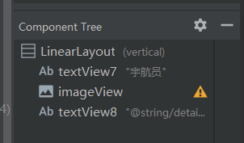
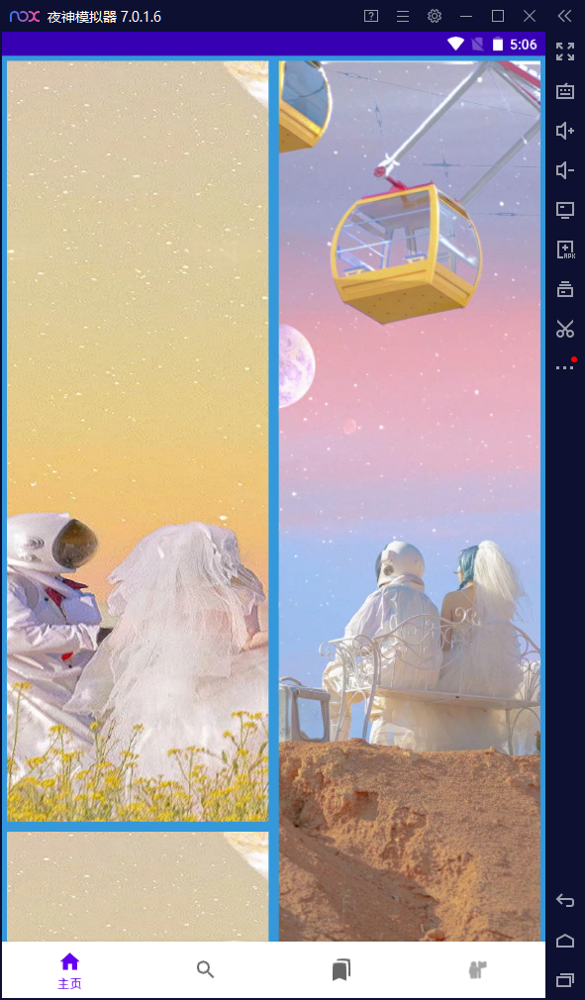
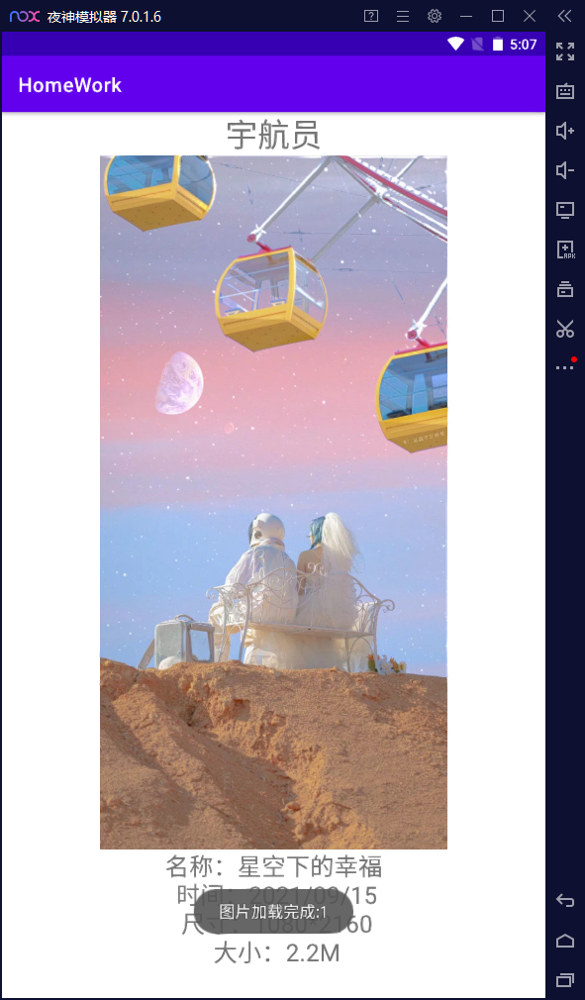
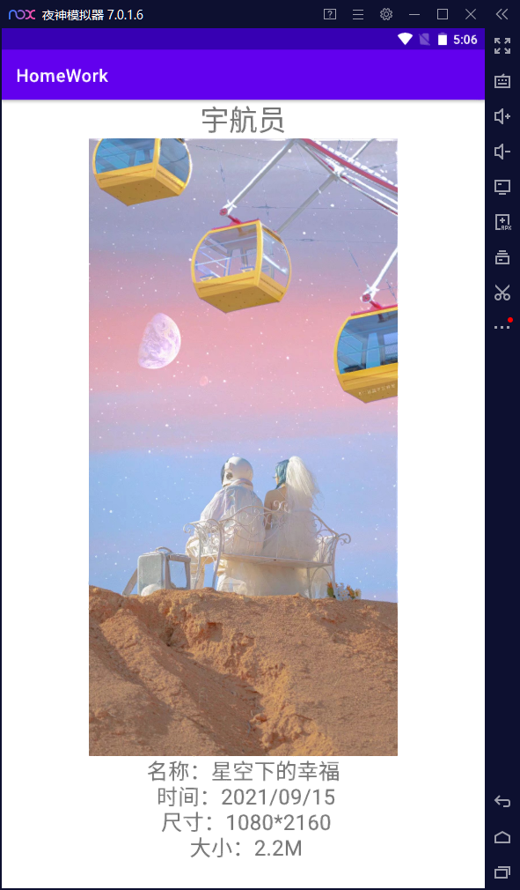

# 页面跳转设计

### 新增内容

##### HomeFragment.java

原主跳转页面，设置跳转方法和页面布局

代码如下

```java
package com.example.homework;

import android.app.appsearch.GetByDocumentIdRequest;
import android.content.Context;
import android.content.Intent;
import android.graphics.Rect;
import android.os.Bundle;
import android.view.LayoutInflater;
import android.view.View;
import android.view.ViewGroup;
import android.widget.Adapter;
import android.widget.SimpleAdapter;
import android.widget.Toast;

import androidx.annotation.NonNull;
import androidx.annotation.Nullable;
import androidx.fragment.app.Fragment;
import androidx.recyclerview.widget.RecyclerView;
import androidx.recyclerview.widget.StaggeredGridLayoutManager;

import java.security.AccessController;
import java.util.ArrayList;
import java.util.HashMap;
import java.util.List;
import java.util.Map;

public class HomeFragment extends Fragment {

    private RecyclerView mRvPu;
    private View view;


    @Override
    public void onCreate(@Nullable Bundle savedInstanceState) {
        super.onCreate(savedInstanceState);

    }

    @Nullable
    @Override
    public View onCreateView(@NonNull LayoutInflater inflater, @Nullable ViewGroup container, @Nullable Bundle savedInstanceState) {
        View view = inflater.inflate(R.layout.home_fragment, container, false);

        mRvPu = (RecyclerView) view.findViewById(R.id.rv_pu);
        mRvPu.setLayoutManager(new StaggeredGridLayoutManager(2,StaggeredGridLayoutManager.VERTICAL));
        mRvPu.addItemDecoration(new MyDecoration());
        mRvPu.setAdapter(new StaggeredGridAdapter(this.getContext(), new StaggeredGridAdapter.OnItemClickListener() {

            @Override
            public void onClick(int pos) {
                Toast.makeText(view.getContext(),"图片正在加载:" + pos, Toast.LENGTH_SHORT).show();

                Bundle bundle = new Bundle();
                bundle.putInt("pos",pos);
                Intent intent = new Intent(getActivity(),PictureDetailActivity.class);
                intent.putExtra("data",bundle);
                startActivityForResult(intent,1);
            }
        }));
        return view;
    }


    @Override
    public void onActivityResult(int requestCode, int resultCode, @Nullable Intent data) {
        super.onActivityResult(requestCode, resultCode, data);
        if(requestCode==1 && resultCode==1){
            //成功返回代码
        }

    }

    @Override
    public void onActivityCreated(Bundle savedInstanceState) {
        super.onActivityCreated(savedInstanceState);

    }

    class MyDecoration extends RecyclerView.ItemDecoration{
        @Override
        public void getItemOffsets(@NonNull Rect outRect, @NonNull View view, @NonNull RecyclerView parent, @NonNull RecyclerView.State state) {
            super.getItemOffsets(outRect, view, parent, state);
            int gap = getResources().getDimensionPixelSize(R.dimen.dividerHeight);
            outRect.set(gap,gap,gap,gap);
        }
    }
}
```

##### StaggeredGridAdapter.java

适配器StaggeredGridAdapter用来管理recycleView的展示

代码如下

```java
package com.example.homework;

import android.annotation.SuppressLint;
import android.content.Context;
import android.content.Intent;
import android.view.LayoutInflater;
import android.view.View;
import android.view.ViewGroup;
import android.widget.AdapterView;
import android.widget.ImageView;
import android.widget.Toast;

import androidx.annotation.NonNull;
import androidx.recyclerview.widget.RecyclerView;

public class StaggeredGridAdapter extends RecyclerView.Adapter<StaggeredGridAdapter.LinearViewHolder> {
    private Context mContext;
    private OnItemClickListener mListener;

    public StaggeredGridAdapter(Context context,OnItemClickListener listener){
        this.mContext = context;
        this.mListener = listener;
    }

    @NonNull
    @Override
    public StaggeredGridAdapter.LinearViewHolder onCreateViewHolder(@NonNull ViewGroup parent, int viewType) {
        return new LinearViewHolder(LayoutInflater.from(mContext).inflate(R.layout.layout_straggered_grid_recyclerview_item,parent,false));
    }

    @Override
    public void onBindViewHolder(@NonNull StaggeredGridAdapter.LinearViewHolder holder, @SuppressLint("RecyclerView") final int position) {
        if(position % 2 != 0){
            holder.imageView.setImageResource(R.drawable.first);
        }else {
            holder.imageView.setImageResource(R.drawable.second);
        }

        holder.itemView.setOnClickListener(new View.OnClickListener() {
            @Override
            public void onClick(View v) {
                mListener.onClick(position);

            }
        });
    }

    @Override
    public int getItemCount() {
        return 30;
    }

    public class LinearViewHolder extends RecyclerView.ViewHolder{
        private ImageView imageView;

        public LinearViewHolder(View itemView) {
            super(itemView);
            imageView = (ImageView) itemView.findViewById(R.id.iv);

        }
    }

    public interface OnItemClickListener{
        void onClick(int pos);
    }
}
```

##### PictureDetailActivity.java

新增PictureDetailActivity.java文件用来展示跳转到的详情界面

代码如下：

```java
package com.example.homework;

import androidx.appcompat.app.AppCompatActivity;

import android.content.Intent;
import android.os.Bundle;
import android.widget.Toast;

public class PictureDetailActivity extends AppCompatActivity {

    @Override
    protected void onCreate(Bundle savedInstanceState) {
        super.onCreate(savedInstanceState);
        setContentView(R.layout.activity_picture_detail);

        Intent intent = getIntent();
        Bundle data = intent.getBundleExtra("data");
        setResult(1,intent);
        int pos = data.getInt("pos");
        intent.putExtra("data",pos);
        Toast.makeText(this,"图片加载完成:" + pos, Toast.LENGTH_SHORT).show();
    }

    @Override
    protected void onStart() {
        super.onStart();
    }

    @Override
    protected void onStop() {
        super.onStop();
    }

    @Override
    protected void onDestroy() {
        super.onDestroy();
    }
}
```

##### activity_picture_detail.xml

展示详情页面的activity_picture_detail.xml文件，用来展示跳转的详情页面布局样式

布局如下



代码如下

```xml
<?xml version="1.0" encoding="utf-8"?>
<LinearLayout xmlns:android="http://schemas.android.com/apk/res/android"
    xmlns:app="http://schemas.android.com/apk/res-auto"
    xmlns:tools="http://schemas.android.com/tools"
    android:layout_width="match_parent"
    android:layout_height="match_parent"
    android:orientation="vertical"
    android:backgroundTint="#3498db"
    tools:context=".PictureDetailActivity">

    <TextView
        android:id="@+id/textView7"
        android:layout_width="match_parent"
        android:layout_height="wrap_content"
        android:textSize="32sp"
        android:gravity="center"
        android:text="宇航员" />

    <ImageView
        android:id="@+id/imageView"
        android:layout_width="match_parent"
        android:layout_height="0dp"
        android:layout_weight="1"
        app:srcCompat="@drawable/first" />

    <TextView
        android:id="@+id/textView8"
        android:layout_width="match_parent"
        android:layout_height="wrap_content"
        android:textSize="24sp"
        android:gravity="center"
        android:singleLine="false"
        android:text="@string/details_describe" />
</LinearLayout>
```

### 展示效果

主页界面



点击跳转，提示信息



最后效果



### 源码地址

[ASFirstHomework: 使用Android studio 进行APP门户界面设计 (gitee.com)](https://gitee.com/taomurong/ASFirstHomework)

